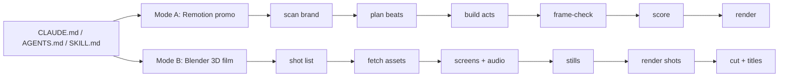

# AKS Productions — Motion Engine

This is a video studio in code. It runs two production modes:

| Mode | What it makes | Stack | Start here |
|---|---|---|---|
| **A: Motion-graphics promo** | 60 s, 1920×1080, high-density (D3+) SaaS/fintech promos with real 3D, built only from a client's real brand assets | Remotion + React + three.js | `CLAUDE.md` §1–7, `docs/NEW_PROJECT.md` |
| **B: 3D short film** | Story-driven vertical films (9:16, 24 fps) with realistic, mocap-animated actors in lit 3D sets | Blender (Python `bpy`) + Remotion for screens and titles | `film3d/README.md`, `CLAUDE.md` §8 |

> **AI agents:** read `AGENTS.md`, then `CLAUDE.md`, then `docs/ARCHITECTURE.mmd`. The portable skill lives at `.claude/skills/motion-engine/SKILL.md`.



## Quick start

```bash
git clone https://github.com/vanshxai/aks-productions-motion-engine && cd aks-productions-motion-engine
npm install                                   # Mode A engine (Node 18+; ffmpeg + python3 for QA/audio)
npx remotion studio                           # live preview
scripts/stills.sh Abwab-60s-silent smoke 150 470 905   # frame-check → qa/smoke.png
scripts/render.sh Abwab-60s out/abwab_60s.mp4          # full render + contact sheet

# Mode B (needs Python 3.11 for Blender's bpy wheel)
film3d/make_film.sh setup     # assets + bpy + screen project deps
film3d/make_film.sh stills    # one still per shot → film3d/build/shots/Sxx/
film3d/make_film.sh all       # full film (hours on CPU; resumable)
```

Detailed Mac setup: `docs/SETUP_MAC.md`. Cloud or serverless rendering: `docs/LAMBDA_SETUP.md`.

## Layout

```
CLAUDE.md                 director's playbook (both modes) — the most important file
AGENTS.md                 entry point for any AI agent
.claude/skills/…          portable skill (same rules, compact)
docs/                     vocabulary, new-project checklist, per-video plans, ARCHITECTURE.mmd, setup guides
src/engine/               reusable Remotion components (2D + 3D), brand-driven via applyBrand()
src/projects/<client>/    one folder per promo (brand.ts, assets.tsx, acts, soundtrack.py)
public/                   fonts, free SFX pack, per-client assets, Poly Haven models (story3d/models)
scripts/                  scan → bundle → decode → trace → stills → render; audio/engine_mix.py
film3d/                   Mode B: Blender pipeline, screen UIs, asset fetcher, shot list
```

## Licences of third-party assets
- **Poly Haven** models: CC0.
- **Microsoft Rocketbox** avatars and animations: MIT.
- **iPhone 14 Pro** model by Imagigoo: CC-BY 4.0 (credit required). The Apple logo is painted out.
- **pmndrs market** office chair: CC0.
- **SFX**: Pixabay Content License.

Client brand assets belong to their owners and are used only for that client's video.
