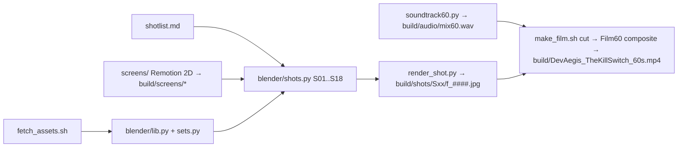

# film3d: 3D short films with realistic actors (Mode B)

The first production is **"The Kill Switch"** for DevAegis (devaegis.com): 60 s, 9:16, 24 fps, 18 shots.

The story: a developer's first client ghosts him after he delivers the code. He finds DevAegis and ships the next build protected. When the client dodges again, he flips the kill switch, the client's portal shows "Service suspended", the client pays, and the film ends on the end card.

## How it works

| File | Role |
|---|---|
| `blender/shotlist.md` | The director's plan: per shot, the lens, move, framing, lighting, duration, action, screen content and sound. |
| `blender/lib.py` | Generic toolkit: `load_character` (Rocketbox import and PBR skin/hair materials), `drive` (mocap via a driver skeleton, auto-grounded), `shape` (blendshapes), lights, `camera`/`key_cam`, `world_hdri`/`world_sky`, `render_settings`. |
| `blender/sets.py` | Materials (plaster, wood floor, screen emission), `laptop`, `phone`, `office_chair`, `project_uv` for screen meshes. |
| `blender/shots.py` | The film. `dev_set`/`office_set` build only what a shot needs. `type_fingers` does keyboard hands (analytic IK). `face_cam` tracks the eyes. `S01…S18` builders sit in the `SHOTS` table. |
| `blender/render_shot.py` | Runs `python render_shot.py -- S05 still 48` or `-- S05 anim`. Env vars: `SPP` (default 8), `PCT` (default 75, i.e. 540×960), `SUBD`, `FILM_*` path overrides. |
| `blender/render_all.sh`, `batch_stills.sh` | Queue helpers; both are resumable. |
| `blender/soundtrack60.py` | Score (chords, plucks, heartbeat, kicks, sub drops) plus SFX from `public/sfx`, cut to shot timings. |
| `screens/` | Remotion project. `scr-<kind>` UI sequences cover the editor, send toast, lock-screen notifications, chat, DevAegis hero, terminal, kill switch, portal→suspended, and payment. `Film60` is the final composite with captions and end card. |
| `fetch_assets.sh` | Downloads the actors, mocap, phone, laptop and chair into `assets/` (gitignored). |
| `make_film.sh` | Runs the steps `setup`, `screens`, `audio`, `stills`, `shots`, `cut` or `all`. |

## Rules that made it work
- **Premade over hand-built.** Nothing that exists as a free asset is modelled by hand.
- **Only what the camera sees.** Inserts skip the actor entirely, which is the biggest render saving.
- **Screens tell the story.** Hold every screen at least 2.5 s and keep the text large. Cuts run 2.5–4 s, except "click" beats.
- **Frame-check first.** Render one still per shot (`make_film.sh stills`) before committing hours to `shots`.

## Known limits
- Rocketbox faces are game-grade, around 5k vertices. Close-ups work at 540×960, but not as a 4K hero close-up.
- Swapping in a real person's face from a 3D scan (Polycam/Scaniverse .glb) is planned, with consent. Fit the scan head onto the Rocketbox skeleton's head bone.
- The client office is the weakest set and needs more dressing.
- CPU render time is about 20–25 s per frame. A machine with a modern GPU (Apple Silicon Metal, NVIDIA OptiX) is 10–30× faster.
